# 1_PortfolioECSについて
&emsp;AWSのクラウドインフラ環境構築と、アプリケーションのデプロイを自動構築した。  
&emsp;プライベートなECS Fargate(アプリケーションコンテナ,nginxコンテナ)、RDS(MySQL)によるサーバー3層構造に、Railsを使用したCRUDアプリケーションをデプロイしたもので、同アプリケーションに投稿した画像はS3に保存される。アプリ管理者用の踏み台EC２実装や、システムエラー時のCloudWatchアラームによるメール通知機能がある。

## 概要の詳細

1. 本クラウドインフラ環境構築は、GitHubへのPushをトリガーに、CircleCIのWorkFromを使って「Terraform」,「Ansible」,「ServerSpec」で自動構築が行われる。  
2. Terraformでは、CRUD操作が可能なRailsのWEBアプリケーションを動作させるための、AWS環境（「ECS Fargate(app_containerコンテナ,nginx_containerコンテナ)」,「RDS(MySQL)」,「ALB」,「S3」,「CloudWatch」,「SNS」,「EC2(踏台用)」,「VPC」)を作成する。  
3. Webアプリケーションの設定ファイルは「raisetech-live8-sample-appディレクトリ」に格納されている。同ディレクトリに保存されているDockerfileとコマンドを使って、既に自動構築されたECRへイメージPushする。
4. Ansibleでは、EC2（踏み台用）内のセットアップを構築する。WEBアプリケーションの管理者は、同EC2にSSH接続し、「ECRリポジトリへのイメージPush」,「ECS Fargateの各コンテナへのECS Exec通信」,「画像保管用S3へのアクセス」が可能となる。  
5. ServerSpecでは、EC2（踏み台用）のセットアップ状況のテストを実施する。  
6. ECS Fargateはプライベート環境で構築され、外部通信にVPCエンドポイントを使用する。app_container(Pumaサーバー、WEBアプリケーションのデプロイ)とnginx_container（WEBサーバー）の2つのコンテナで実装される。    
&emsp;CPU使用率75%以上でコンテナのスケールアウト、CPU使用率25%以下でコンテナのスケールインを行う。  
7. ECS Fargateの状態監視をALB,ターゲットグループで行い、通信異常が発生した場合はCloudWatchアラーム通知,SNSでメール送信を行う。

&emsp;構成図  
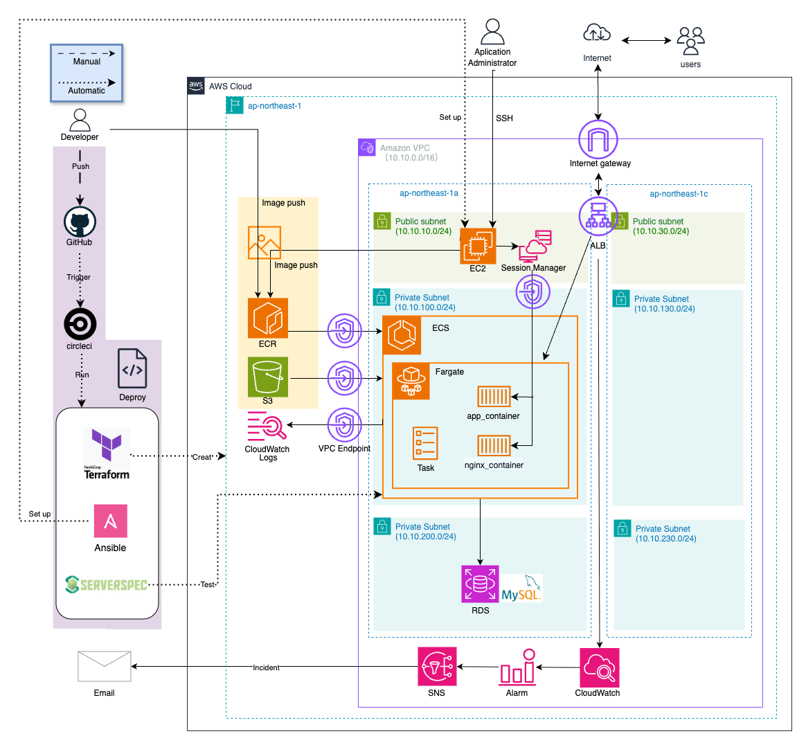
&emsp;VPCリソースマップ
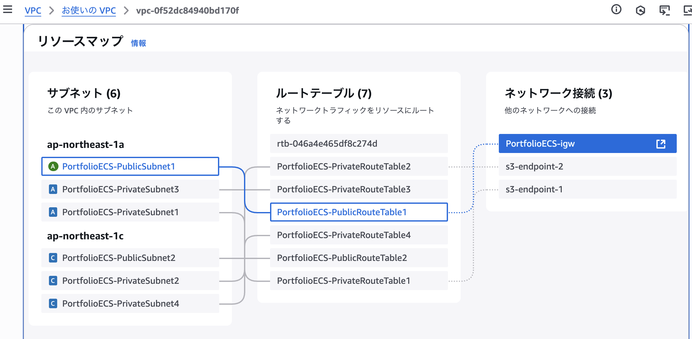

## 1. CircleCIによる環境変数・SSH Key設定と、実行状況  
&emsp;CircleCI上で、環境変数（AWSへの接続,Terraform・Ansible・ServerSpec各々に必要な環境変数）とSSH Key設定を実施。
   
&emsp;CIrcleCIの環境変数設定
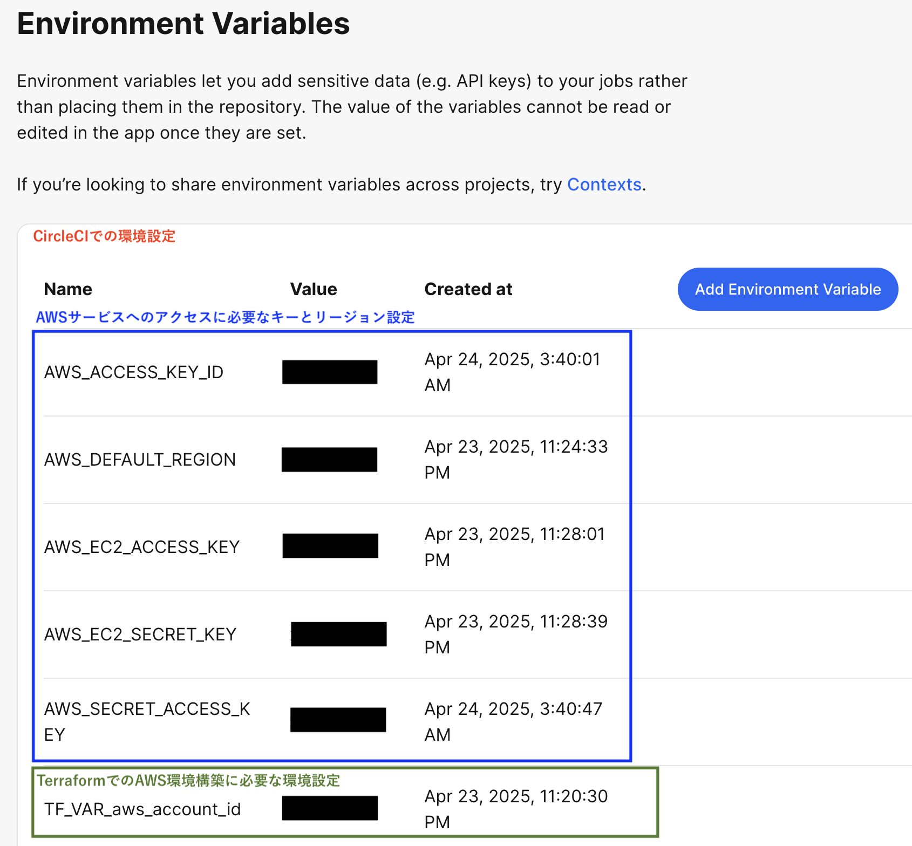
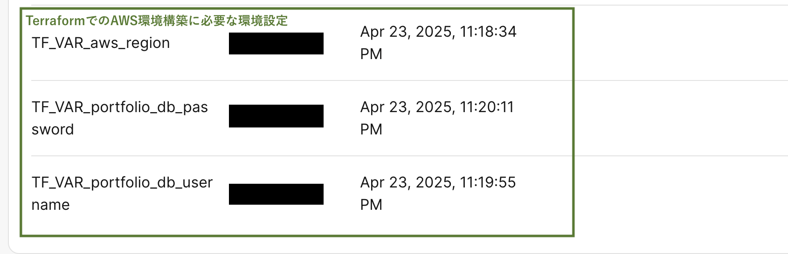
  
&emsp;CircleCIのSSH Key設定
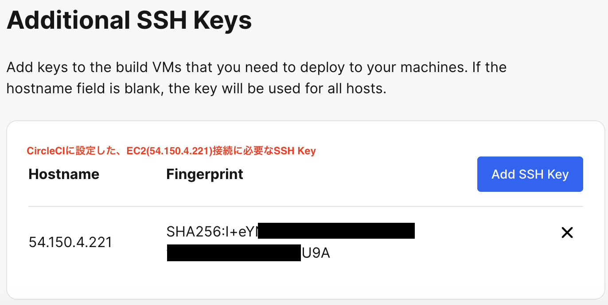
  
&emsp;CircleCIのworkfrow実行状況  
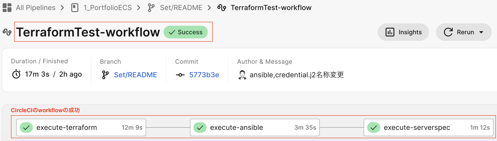
  

template
- [**config.yml**](/.circleci/config.yml)

## 2. Terraformの各モジュール設定
- ルートモジュールをenv/devに作成。開発環境と本番環境でルートモジュールを分けることができ、ルートモジュールから、子モジュールを呼び出せるよう、下図のディレクトリ構成とした。
  
&emsp;CircleCIのTerraform実行状況  
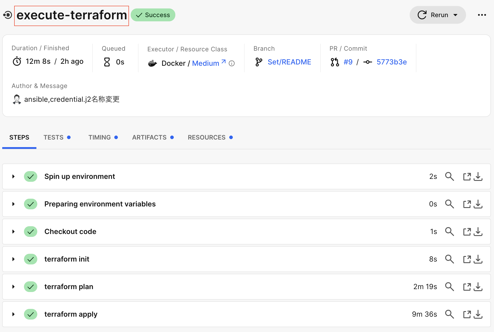 
  
&emsp;Terraformのディレクトリ構成
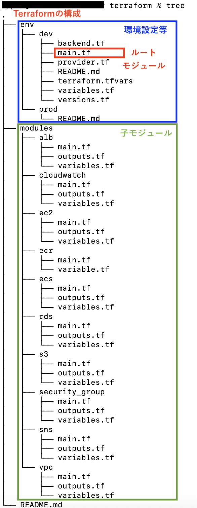 

template
- [**dev/main.tf(ルートモジュール)**](/terraform/env/dev/main.tf)  
- [**alb/main.tf**](/terraform/modules/alb/main.tf) 
- [**clouwatch/main.tf**](terraform/modules/cloudwatch/main.tf)  
- [**ec2/main.tf**](/terraform/modules/ec2/main.tf)
- [**ecr/main.tf**](/terraform/modules/ecr/main.tf)
- [**ecs/main.tf**](/terraform/modules/ecs/main.tf)
- [**rds/main.tf**](/terraform/modules/rds/main.tf)
- [**s3/main.tf**](/terraform/modules/s3/main.tf)
- [**security_group/main.tf**](/terraform/modules/security_group/main.tf)
- [**sns/main.tf**](/terraform/modules/sns/main.tf)
- [**vpc/main.tf**](/terraform/modules/vpc/main.tf)

## 3. Ansibleのセットアップ設定
- EC2（踏み台）に必要な各種ツールのインストールや設定を実行。  
  
&emsp;CircleCIのAnsible実行状況  
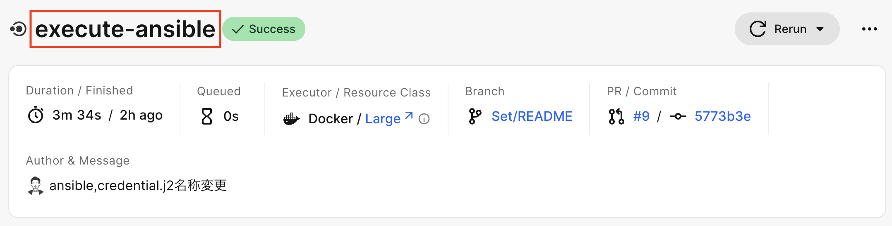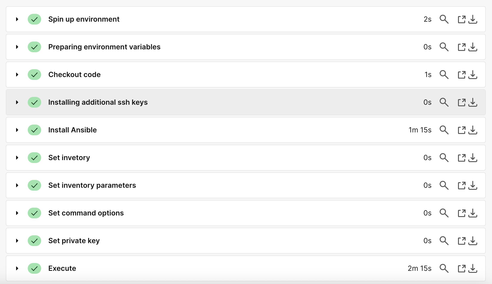    

&emsp;Ansibleのディレクトリ構成 
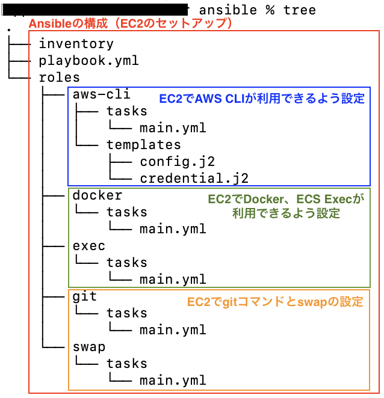

Template(Ansibleの設定ファイル）
 - [**inventory.yml**](/ansible/inventory)  
 - [**playbook.yml**](/ansible/playbook.yml)  
 - [**main.yml(aws-cli)**](/ansible/roles/aws-cli/tasks/main.yml) 
 - [**main.yml(docker)**](/ansible/roles/docker/tasks/main.yml)     
 - [**main.yml(exec)**](/ansible/roles/exec/tasks/main.yml)     
 - [**main.yml(git)**](/ansible/roles/git/tasks/main.yml)     
 - [**main.yml(swap)**](/ansible/roles/swap/tasks/main.yml)      

## 4. ServerspecによるEC2セットアップ状況のテスト
「gitのインストール状況」,「S3へのアクセス確認」,「SessionManagerのPluginインストール状況」,「Dockerの起動確認」をテスト。  
  
&emsp;CircleCIのServerspec実行状況
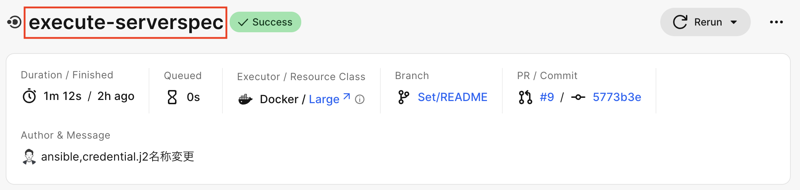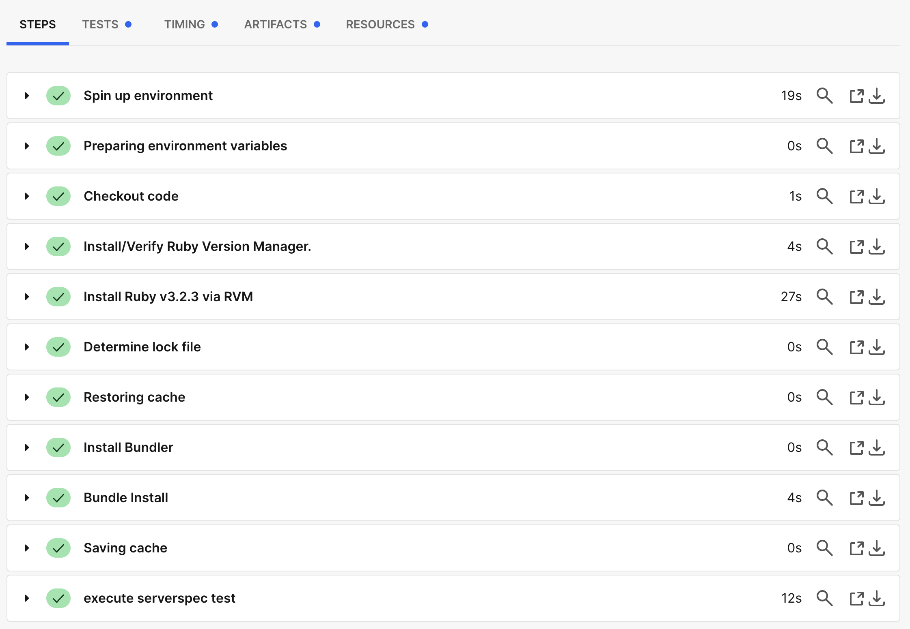
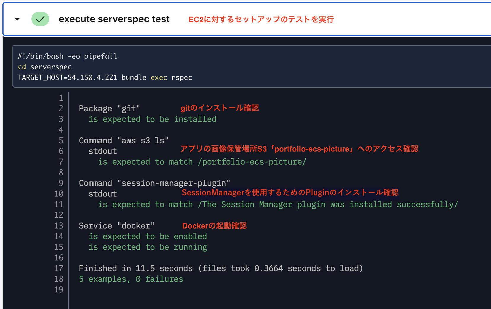

template
 - [**Gemfile**](/serverspec/Gemfile)  
 - [**sample_spec.rb**](/serverspec/spec/54.150.4.221/sample_spec.rb)
  
  
## 5. ECRへのイメージプッシュ  
&emsp;Webアプリケーションの設定ファイルは「raisetech-live8-sample-appディレクトリ」に格納されている。  
&emsp; ECRへのイメージPushは、自動構築されたECRリポジトリに対して、コマンドで実行する。使用するDockerfileの保存場所は以下のとおり。
- 「app_container（/raisetech-live8-sample-app/Dockerfile）」
- 「nginx_container（/raisetech-live8-sample-app/nginx/Dockerfile）」
    
&emsp;ECRに自動構築されたリポジトリ
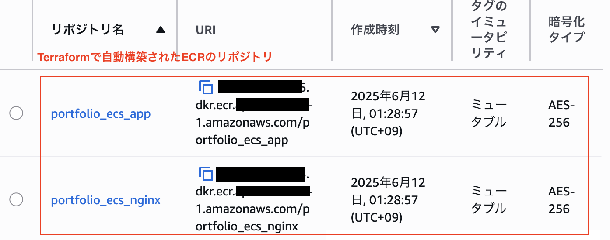

&emsp;ECRへのイメージPushコマンド
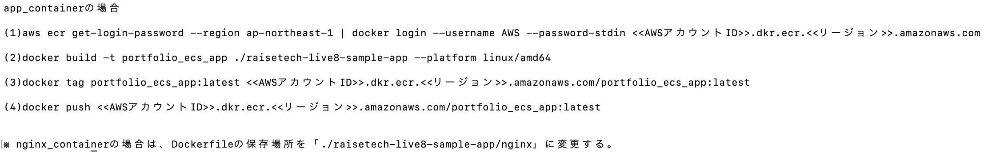

template
 - [**app_containerのDockerfile（/raisetech-live8-sample-app/Dockerfile）**](/raisetech-live8-sample-app/Dockerfile)
 - [**nginx_containerのDockerfile（/raisetech-live8-sample-app/nginx/Dockerfile）**](/raisetech-live8-sample-app/nginx/Dockerfile)
  
  
## 6. EC2（踏み台用）の各種機能
(1) ECRにイメージがPushできることの確認  
&emsp;ECRに確認用のsampleリポジトリを作成  
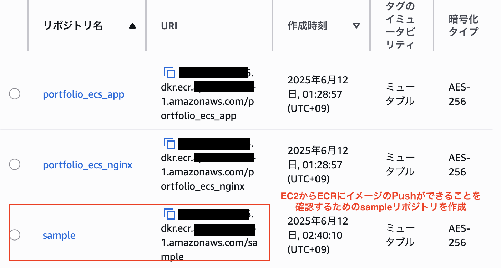

&emsp;EC2にSSH接続し、イメージ作成用のDockerfileを作成  
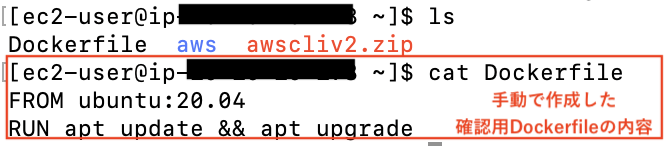

&emsp;EC2で作成したイメージをECRにプッシュする      
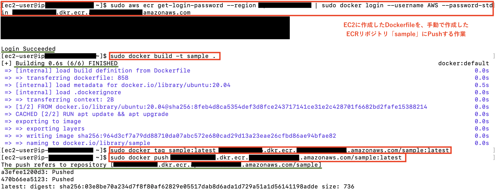

(2) ECS FargateへECS Exec通信ができることの確認  
&emsp;EC2にSSH接続し、ECS Execでコンテナに接続、コマンドを実行   
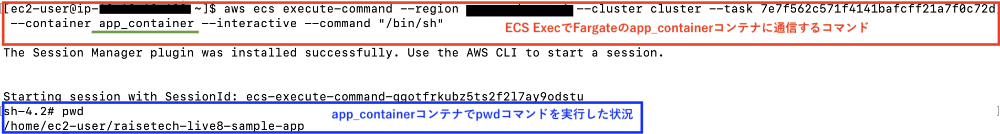

(3) アプリの画像保管場所、S3バケットに接続できることの確認  
&emsp;EC2にSSH接続し、awsコマンドでバケットの内部データを確認                         
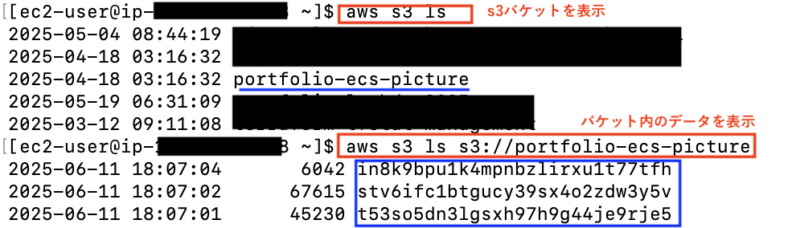

  
## 7. Fargateのコンテナとスケーリングの確認   
&emsp;ECS Fargateのタスクと、コンテナ（app_container、nginx_container）作成状況。   
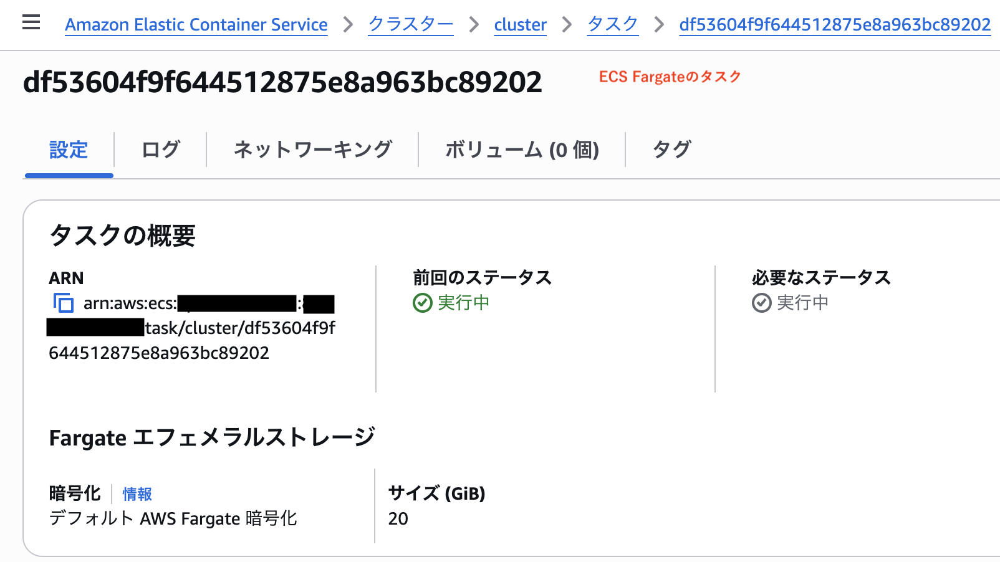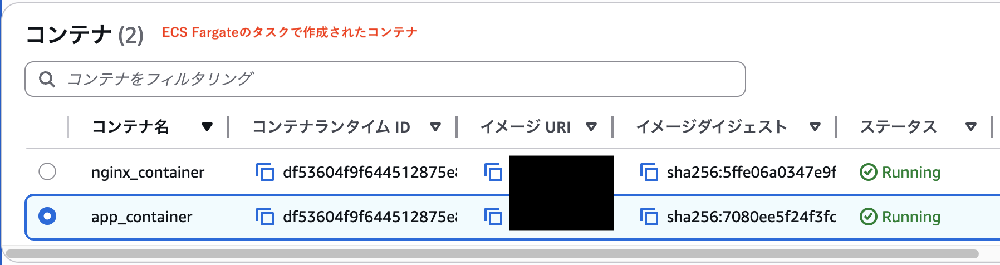

&emsp;ECSのスケーリング設定と、実際にスケールアウト、インが実行された記録。   
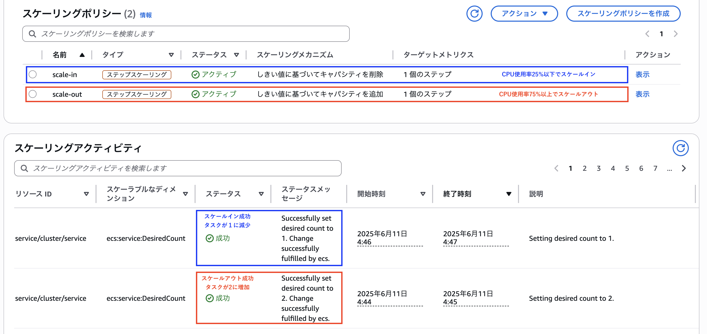

&emsp;スケールアウトのアラーム内容（CPU使用率75%以上の場合実施） 
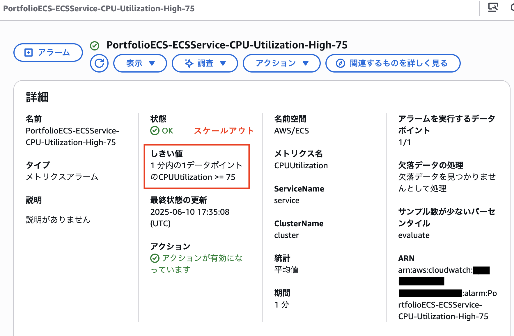

&emsp;スケールインのアラーム内容（CPU使用率25%より小さい場合実施）                   
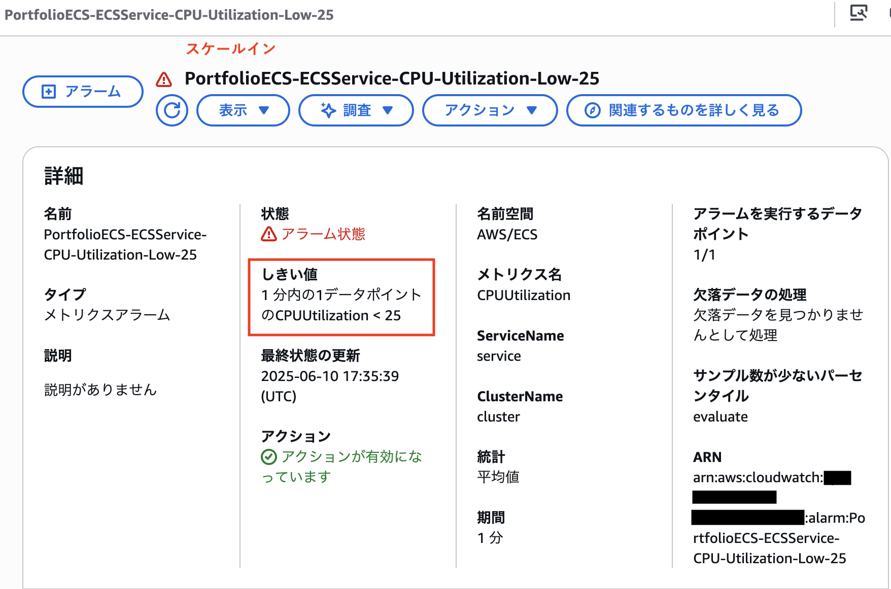

&emsp;ECS サービス画面から、スケールアウトでタスクが2個に増えた時の状況を確認。    
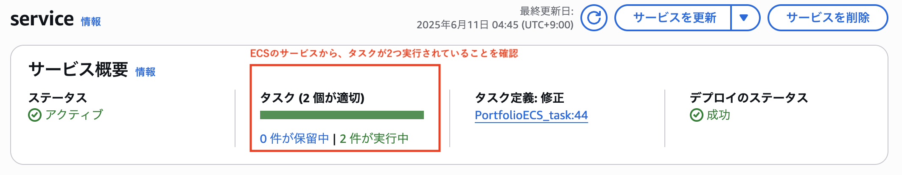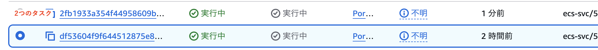  
    

## 8. ECSに通信異常が発生した場合のアラーム通知   
&emsp;ECS Fargateの通信状態を確認するALBと、ターゲットグループ。  
  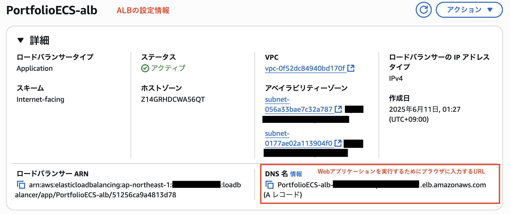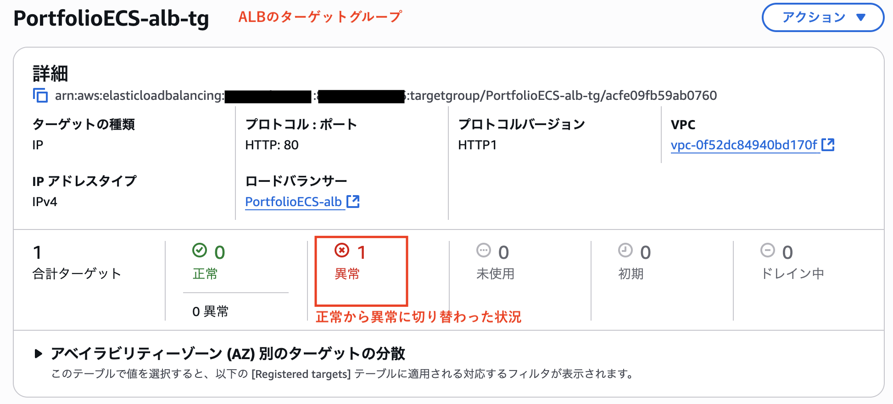

&emsp;CloudWatchアラーム通知と、送信されたメールの内容。 
  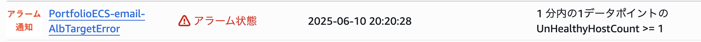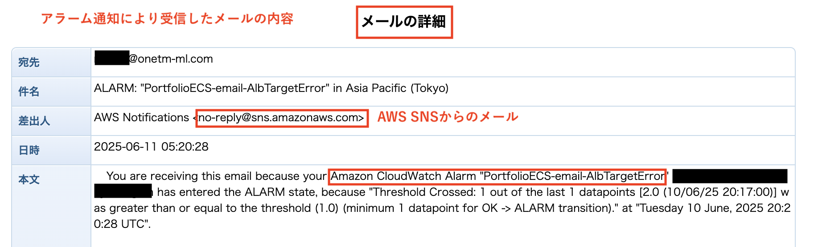

    
## 9. アプリの実行状況確認
&emsp;自動デプロイした Webアプリケーションに、ALBのDNS名を使ってブラウザーから接続。画像を保存してS3に追加、削除されるまでを確認した。  
- Webアプリケーションのトップページを表示    
  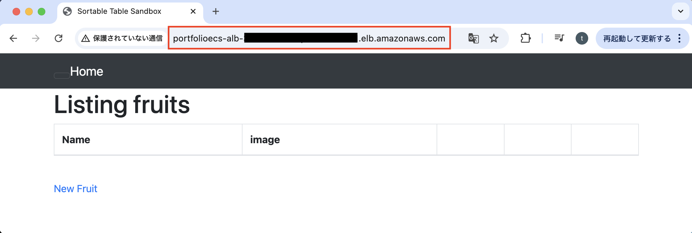

- アプリに画像を追加した状況でのトップページ   
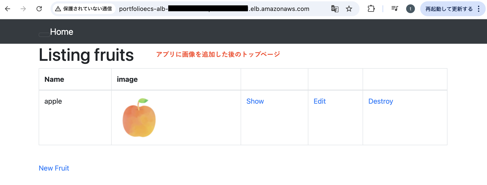

- S3に画像が保存された状況    
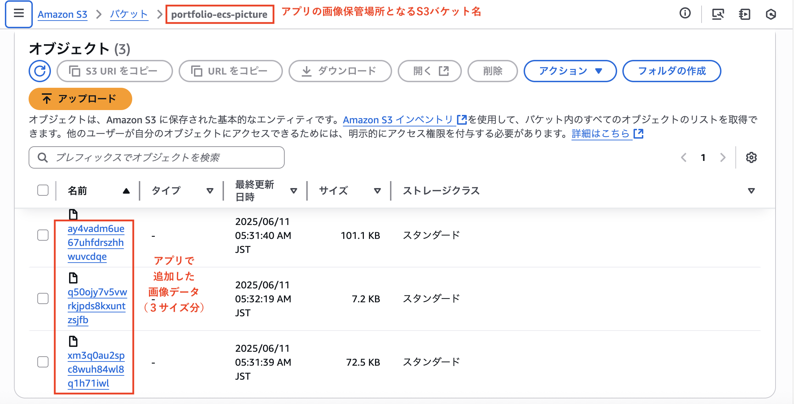

- S3の画像を表示した状況    
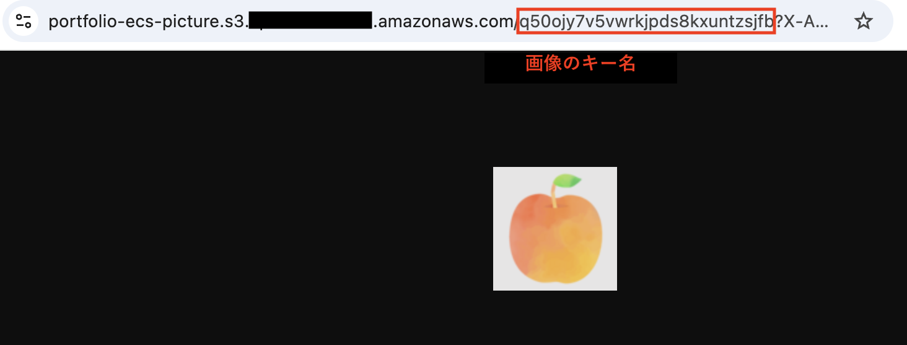

- アプリで画像を削除し
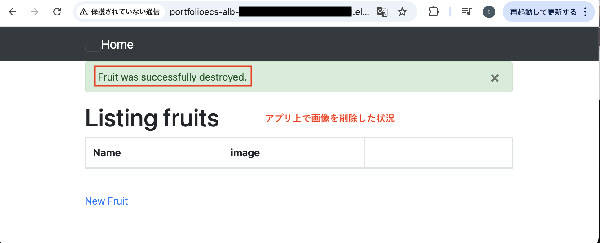

- S3の画像も削除が反映された状況  
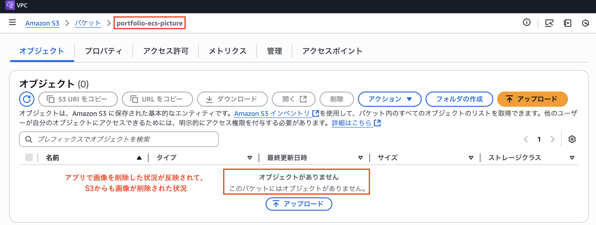

## 10. 考察、その他参考
&emsp;CI/CDでの環境構築を実現するため、TerraformやAnsibleによるコード化や、コンテナ利用によるサーバレス化を想定してECS（Fargate）を導入し、ポートフォリオを作成した。本環境構築において、以下のとおり考察して行った。
- 今回はクラウドインフラ環境の構築画面となっているため、Webアプリケーションについては簡易なものとなっている。また、マルチAZ構成による冗長化がベストプラクティスであるが、費用面から一部省略している。  
- セキュリティーグループ設定においては、CircleCIの無料版を使用している都合上、パブリックIPアドレス設定部分を0.0.0.0（オール）で実行可能にしている。
- ECS Exec通信を行えば、踏み台EC2を作らなくてもダイレクトにFargateコンテナに通信できるが、今回は自分のPC環境を使いたくない場合や、環境構築の経験として、敢えて踏み台用EC2を作成した。
- 踏み台EC2への通信をSessionManagerで行った方が22番ポートを開かなくて済むため、よりセキュアになるが、VPCエンドポイントの作成件数が増え、費用対効果の面であえてSSH通信とした。
-  プライベートなFargateからの外部通信にNATゲートウェイも活用できるが、ECRからのイメージ取得が頻繁に行われる場合など、転送料金が大きくなる場合があり、VPCエンドポイントでの設計を行なった。

